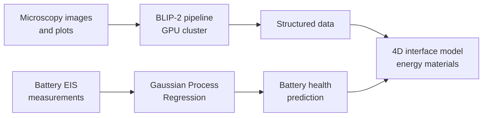
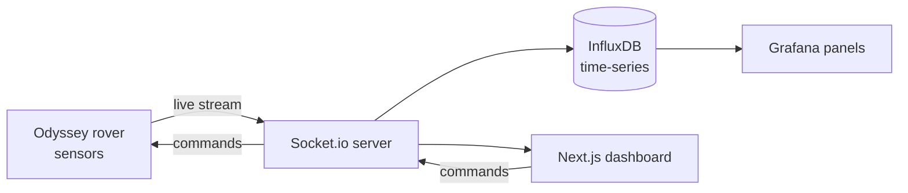
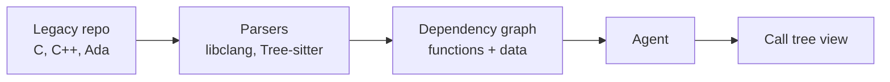

# Flowcharts — must be built

Every featured project gets a diagram. They are **hand-authored SVG** in
`content/diagrams.ts` — explicit coordinates, straight lines and right angles only, no
crossings, no layout engine. The Mermaid blocks below and in `case-studies/` describe
what each diagram shows; `content/diagrams.ts` is what renders.

| Diagram | Key in `content/diagrams.ts` | Shown on |
|---|---|---|
| NestuLabs AI Visibility | `nestulabs-ai-visibility` | home (project panel, links to case study) + case study |
| CRDT editing engine | `crdt-engine` | home + case study |
| Agentic trading (phase one) | `agentic-trading` | home + case study |
| Agentic trading (phase two) | `agentic-trading-phase-two` | case study |
| Rolston Lab research | `rolston-lab-research` | home |
| Odyssey rover telemetry | `odyssey-rover-telemetry` | experience row (expand) |
| AeroTrace | `aerotrace` | hackathons panel |

On the home page a diagram is the panel's media only when the project has no demo video
and no screenshot. It is always on the case study page.

## NestuLabs AI Visibility — layout

Row 1: WordPress plugin → Business website (JSON-LD + llms.txt) → AI assistants.
Row 2: Weekly tracker → AI assistants ("asks test questions"); Weekly tracker → Dashboard
for the owner.

## Rolston Lab research — scientific data pipeline

## Odyssey rover telemetry — Interplanetary Lab, ASU

## AeroTrace — Honeywell Aerospace Devils Invent

