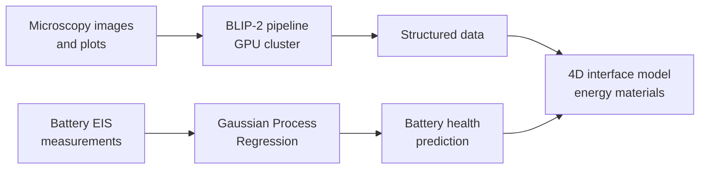
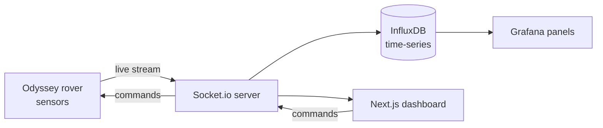

# Flowcharts — must be built

Every featured project gets a flowchart. Claude Code must render each one as a
clean SVG (not a screenshot, not a live Mermaid script in the browser).

| Project | Where the diagram lives | Shown on |
|---|---|---|
| Agentic trading (phase one + two) | `case-studies/agentic-trading.md` | home (small) + case study |
| CRDT editing engine | `case-studies/crdt-engine.md` | home (small) + case study |
| NestuLabs AI Visibility | `case-studies/nestulabs-ai-visibility.md` | home (small) + case study |
| Rolston Lab research | below | home (small) |
| Odyssey rover telemetry | below | experience row (expand) + more projects |

## Rolston Lab research — scientific data pipeline

## Odyssey rover telemetry — Interplanetary Lab, ASU

