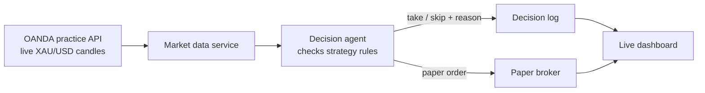
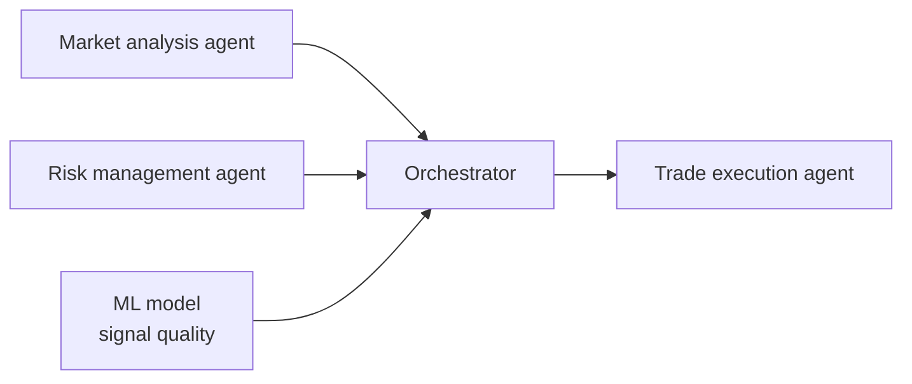

## The question
Most "AI trading bots" chase profit and hide their reasoning. This research project,
run with [ADD: professor name, if they're OK being named], asks a simpler question first:
**can an agent follow a clear set of strategy rules on live market data — and tell us
why it took or skipped each trade?**

Profit is not the goal of phase one. Understanding the agent's decisions is.

## What I built (phase one)
- A live feed of gold (XAU/USD) candles from the OANDA practice API.
- An agent that checks each new candle against my predefined strategy conditions and
  decides: take the trade, or skip it.
- A decision log: every choice is saved with the inputs the agent saw and its reason.
- A live paper-trading dashboard to watch it happen. No real money is used.

## How it fits together

## Phase two (planned)

Separate agents for market conditions and timing, risk, and trade placement —
plus an ML model — so each part can be tested on its own.

## Key decisions
- **Build my own system** instead of using an open-source trading-agent framework.
  I studied those repos and papers, but I wanted full control over how decisions are
  made and logged.
- **Start with one instrument (gold).** High volume and one market keeps the first
  experiment clean. Other forex pairs come later.
- **Paper trading first.** Safe, and every decision can be replayed and checked.
- [ADD: which model/LLM runs the agent, and why]

## Results so far
- [ADD: number of decisions logged]
- [ADD: how often the agent's decision matched the rules when checked by hand]
- [ADD: one surprising thing you learned about how the agent reasons]

## What I'd do next
- Finish phase two's multi-agent split.
- Add a replay mode that runs the agents over past data for fast testing.
- [ADD]
