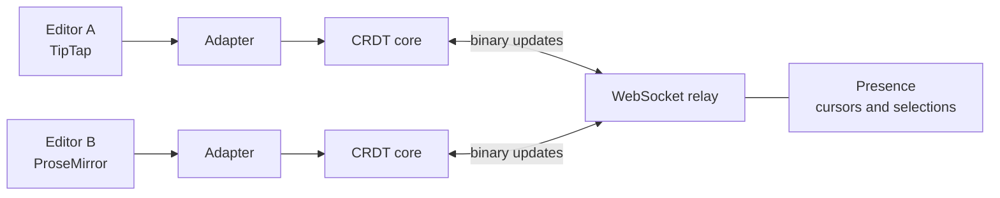

## Why I built it
Google Docs-style editing feels like magic: many people type at once and nobody's
work gets lost. Most apps get this from a library like Yjs. I wanted to understand
how it actually works, so I built the sync engine myself.

**The rule I set:** no Yjs, Automerge, ShareDB, Liveblocks, Replicache, or any other
existing CRDT/OT library. Only standard networking and utility code.

## What it does
- Many people can edit the same text at the same time; edits always merge the same way
  on every device (a CRDT — conflict-free replicated data type).
- After the first load, only small changes are sent — never the whole document.
- Changes travel in a compact custom binary format over WebSockets.
- Shows other people's cursors and selections live.
- Works with TipTap / ProseMirror through an editor-agnostic TypeScript API.

## How it fits together

## Key decisions
- [ADD: which CRDT approach you used for text (e.g. how you order characters and handle deletes) and why]
- [ADD: what the binary update format looks like and how big a typical edit is]
- [ADD: how you handle a user who goes offline and comes back]

## Targets vs measured
| What | Target | Measured |
|---|---|---|
| Local edit applied | under 5 ms | [ADD] |
| Remote edit shows up | under 100 ms | [ADD] |
| People editing at once | 100+ | [ADD] |
| Operations handled | millions | [ADD] |

## How I tested it
Unit tests, concurrency tests (many simulated users typing at once), stress tests,
and performance benchmarks. [ADD: test count, and a link to the benchmark script]

## What I'd do next
- [ADD]
