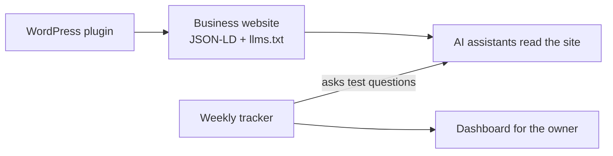

## The problem
More people ask ChatGPT, Gemini, and Perplexity "what's the best X near me?" instead of
searching Google. Most business websites aren't set up for AI assistants to read, and
owners have no way to see whether they're being recommended.

## What I built
- **A WordPress plugin** (approved on WordPress.org) that adds clean structured data
  (JSON-LD) and an llms.txt file, so AI assistants can understand the site.
- **Weekly tracking** that checks whether a brand shows up in answers from ChatGPT,
  Gemini, and Perplexity.
- **A SHOPLINE partnership** (signed July 2026) to bring this to SHOPLINE merchants.

## How it fits together

## Key decisions
- [ADD: why a plugin first instead of a standalone SaaS]
- [ADD: how the tracker picks test questions]

## Results
- [ADD: installs / sites / merchants]
- [ADD: one before-and-after example, if a client agrees]

## Also built for NestuLabs
nestulabs.com (Next.js, Tailwind, Supabase) with an SEO/AEO setup, a "Roast My Business"
lead tool, and an outreach pipeline; a Next.js site for a dermatology clinic.
